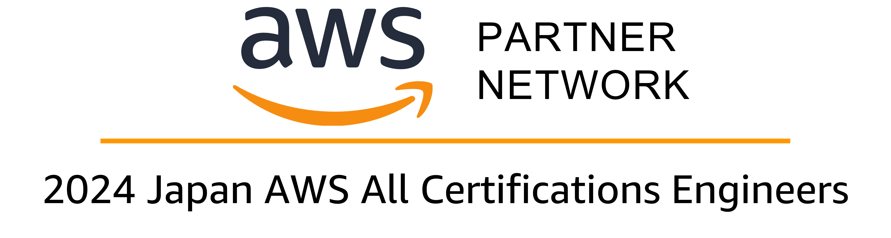

## Profile<!-- omit in toc -->

| key      | value                                                      |
| -------- | ---------------------------------------------------------- |
| Name     | TOMOAKI Ishihara                                           |
| Birthday | September 29th, 1979                                       |
| Company  | [NTT DATA CCS CORPORATION](https://www.nttdata-ccs.co.jp/) |
| Position | Cloud Engineer                                             |

## Contents<!-- omit in toc -->

- [SPECIAL SKILLS](#special-skills)
- [HONORS \& AWARDS](#honors--awards)
- [QUALIFICATIONS](#qualifications)
- [EDUCATION](#education)
- [WORK EXPERIENCE](#work-experience)
  - [NTT DATA CCS CORPORATIONS (April, 2004 - present)](#ntt-data-ccs-corporations-april-2004---present)
- [INTEREST](#interest)
- [LINKS](#links)
  - [Zenn](#zenn)
  - [AWS 勉強会資料公開](#aws-勉強会資料公開)
  - [GitHub](#github)
- [ADDITIONAL INFORMATION](#additional-information)

---

## SPECIAL SKILLS

- プロジェクト運営の能力
  - 職種や技術領域をまたいだ、全体最適を目指した問題解決とプロジェクト推進
  - Backlog / Redmine を用いたタスクの効率的な管理と、Slack / Teams などによるチーム内、顧客とのスムーズな非同期コミュニケーション
- 上流工程の経験
  - 現行システムの調査分析、要件定義、移行計画書の作成（変更仕様の確定）
- 開発経験
  - Amazon Web Services(AWS) を活用した小～中規模のWebアプリケーションシステムの設計
  - AWS CDK および AWS CloudFormation を使用した Infrastructure as Code（IaC） による環境構築の自動化
  - AWS CodeCommit, CodePipeline, CodeBuild, CodeDeploy を用いた CI/CD 環境の構築、メンテナンス
  - 本番環境における Docker の経験
  - PostgreSQL, MySQL、Oracle 等の RDB の設計、パフォーマンス改善、管理
- その他
  - 勉強会、社内学習のコミュニティ形成

---

## HONORS & AWARDS

- 2024 Japan AWS Top Engineers
  - 
  - [APN Blog](https://aws.amazon.com/jp/blogs/psa/2024-japan-aws-top-engineers/)

- 2024 Japan AWS All Certifications Engineers
  - 
  - [APN Blog](https://aws.amazon.com/jp/blogs/psa/2024-japan-aws-all-certifications-engineers/)

## QUALIFICATIONS

- 普通自動車第一種運転免許 / Driver's License (1st grade)
- 情報処理技術者試験 / ITEE（Information Technology Engineers Examination）
  - ネットワークスペシャリスト試験 (December 11, 2015) / Network Specialist Examination
  - データベーススペシャリスト試験 (June 20, 2014) / Database Specialist Examination
  - 応用情報技術者試験 (June 15, 2012) / Applied Information Technology Engineer Examination
  - 基本情報技術者試験 (November 19, 2002) / Fundamental Information Technology Engineer Examination
- AWS Certified
  - [AWS Certified Solutions Architect – Professional (October 26, 2022)](https://www.credly.com/badges/bad38ea2-4970-4cc6-ad8d-ff396d703c1e/public_url)
  - [AWS Certified DevOps Engineer – Professional (May 31, 2023)](https://www.credly.com/badges/2008cdbf-84f7-40f1-9618-29a31e5d08ab/public_url)
  - [AWS Certified Solutions Architect – Associate (August 24, 2022)](https://www.credly.com/badges/9a95c5e3-5586-41f3-a310-dc56a8d464a9/public_url)
  - [AWS Certified SysOps Administrator – Associate (April 27, 2023)](https://www.credly.com/badges/7d49f9af-18c3-4dde-853a-9ea33fd00d78/public_url)
  - [AWS Certified Developer – Associate (February 15, 2023)](https://www.credly.com/badges/fa1caa18-e8ea-415e-8d76-4b2a35afe1c3/public_url)
  - [AWS Certified Cloud Practitioner (November 25, 2022)](https://www.credly.com/badges/5e92182e-b71e-43ab-9b76-e020df40d0e9/public_url)

- AWS 認定 Specialty
  - [AWS Certified Security – Specialty (January 22, 2024)](https://www.credly.com/badges/7fa93a22-d41f-4bb4-b448-6a2eed1bd848/public_url)
  - [AWS Certified Database – Specialty (February 15, 2024)](https://www.credly.com/badges/57be108d-6997-4334-aa63-257c4fb43a7e/public_url)
  - [AWS Certified Data Analytics – Specialty (February 29, 2024)](https://www.credly.com/badges/84364214-cac5-4050-841f-6ffac4f7f72f/public_url)
  - [AWS Certified Advanced Networking – Specialty (March 7, 2024)](https://www.credly.com/badges/89723402-7735-417d-a106-f710c2f3b598/public_url)
  - [AWS Certified Machine Learning – Specialty (March 15, 2024)](https://www.credly.com/badges/04670fe9-97f9-4762-b8ed-26ab5dc2faeb/public_url)
  - [AWS Certified SAP on AWS - Specialty (March 19, 2024)](https://www.credly.com/badges/f5977f16-8340-4fe7-b767-f4332a3b50aa/public_url)

- [AWS Cloud Quest](https://aws.amazon.com/jp/training/digital/aws-cloud-quest/)
  - [AWS Cloud Quest: Cloud Practitioner (January 18, 2024)](https://www.credly.com/badges/b967f1e4-9e6e-46d6-9ffb-cdecb437c761/public_url)
  - [AWS Cloud Quest: Security (January 19, 2022)](https://www.credly.com/badges/028ffc84-6d7a-4429-844a-8221ac22f2d8/public_url)
  - [AWS Cloud Quest: Solutions Architect (January 19, 2024)](https://www.credly.com/badges/edc90c52-6bbc-41fa-9ddb-2ccda121132e/public_url)
  - [AWS Cloud Quest: Serverless Developer (January 19, 2024)](https://www.credly.com/badges/bdde8fbc-2236-40c1-a261-576d752248bd/public_url)
  - [AWS Cloud Quest: Data Analytics (January 20, 2024)](https://www.credly.com/badges/4758de7e-52cc-4791-9507-467d83339965/public_url)
  - [AWS Cloud Quest: Networking (January 22, 2024)](https://www.credly.com/badges/bc5ebe9a-8942-41f4-bf16-4a99cb0f4a7d/public_url)
  - [AWS Cloud Quest: Machine Learning (January 24, 2024)](https://www.credly.com/badges/78b39aff-083b-465a-a61a-38daff1d648d/public_url)

- Oracle
  - [Oracle Cloud Infrastructure Foundations 2021 Certified Associate (March 29, 2022)](https://catalog-education.oracle.com/pls/certview/sharebadge?id=6A64358C41C39B4C58D7E1DABEBE8D4C37E2D5FD3EE83D03E952D0A9301657B1)
  - ORACLE MASTER Gold Oracle Database 10g (July 9, 2012)
  - ORACLE MASTER Silver Oracle Database 10g (February 28, 2012)
  - ORACLE MASTER Bronze Oracle Database 10g (December 9, 2011)
  - Oracle Silver Fellow (December 1, 2004)
  - ORACLE MASTER Silver
- Microsoft Azure認定資格
  - [Azure Solutions Architect Expert (February 25, 2022)](https://learn.microsoft.com/api/credentials/share/ja-jp/ishr-6997/2481EDFDC897A1C8?sharingId=EC4CFA5845D2040B)
  - [DevOps Engineer Expert (April 07, 2022)](https://learn.microsoft.com/api/credentials/share/ja-jp/ishr-6997/CD163B7320AF150B?sharingId=EC4CFA5845D2040B)
  - [Azure Security Engineer Associate (July 29, 2022)](https://learn.microsoft.com/api/credentials/share/ja-jp/ishr-6997/AD0F409D98F08F4B?sharingId=EC4CFA5845D2040B)
  - [Azure Network Engineer Associate (July 15, 2022)](https://learn.microsoft.com/api/credentials/share/ja-jp/ishr-6997/69657F58970BAFD4?sharingId=EC4CFA5845D2040B)
  - [Azure Developer Associate (March 10, 2022)](https://learn.microsoft.com/api/credentials/share/ja-jp/ishr-6997/DEB7ACB6807849C1?sharingId=EC4CFA5845D2040B)
  - [Azure Administrator Associate (January 26, 2022)](https://learn.microsoft.com/api/credentials/share/ja-jp/ishr-6997/E1C6A3278E01E7E0?sharingId=EC4CFA5845D2040B)
  - [Azure Fundamentals (December 17, 2021)](https://learn.microsoft.com/api/credentials/share/ja-jp/ishr-6997/50F07DF8CDB1AFC?sharingId=EC4CFA5845D2040B)

---

## EDUCATION

---

## WORK EXPERIENCE

### <u>NTT DATA CCS CORPORATIONS (April, 2004 - present)</u>

---

## INTEREST

- バックエンド・インフラだけでなく、新しい分野・技術への興味関心が高く、学習しながらアウトプットすることを意識しています
- フロントエンドの技術向上に力を入れています
- UI / UX を学ぶために書籍を読んだり、オンラインの勉強会へ参加しています

---

## LINKS

### Zenn

### [AWS 勉強会資料公開](https://ishiharatma.github.io/aws-study/)

### GitHub

---

## ADDITIONAL INFORMATION
