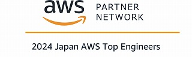
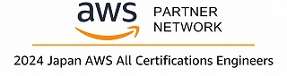

## Profile<!-- omit in toc -->

| key      | value                                                      |
| -------- | ---------------------------------------------------------- |
| Name     | TOMOAKI Ishihara                                           |
| Birthday | September 29th, 1979                                       |
| Company  | [NTT DATA CCS CORPORATION](https://www.nttdata-ccs.co.jp/) |
| Position | Cloud Engineer                                             |

---

## SPECIAL SKILLS

- プロジェクト運営の能力 / Project Management Skills
  - 職種や技術領域をまたいだ、全体最適を目指した問題解決とプロジェクト推進
    - Cross-functional problem-solving and project advancement aimed at overall optimization across different job types and technical domains.
  - Backlog / Redmine を用いたタスクの効率的な管理と、Slack / Teams などによるチーム内、顧客とのスムーズな非同期コミュニケーション
    - Efficient task management using Backlog / Redmine, and smooth asynchronous communication within teams and with clients using Slack / Teams
- 上流工程の経験 / Experience in Upstream Processes
  - 現行システムの調査分析、要件定義、移行計画書の作成（変更仕様の確定）
    - Analysis of existing systems, requirements definition, creation of migration plans (finalization of change specifications)
- 開発経験 / Development Experience
  - Amazon Web Services(AWS) を活用した小～中規模のWebアプリケーションシステムの設計
    - Design of small to medium-scale web application systems utilizing Amazon Web Services (AWS)
    - Amazon CloudFront / AWS WAF / AWS Lambda / Amazon API Gateway / AWS ECS / AWS Fargate / Amazon Aurora / Amazon Athena etc...
  - AWS CDK および AWS CloudFormation を使用した Infrastructure as Code（IaC） による環境構築の自動化
    - Automation of environment setup using Infrastructure as Code (IaC) with AWS CDK and AWS CloudFormation
  - AWS CodeCommit, CodePipeline, CodeBuild, CodeDeploy を用いた CI/CD 環境の構築、メンテナンス
    - Building and maintenance of CI/CD environments using AWS CodeCommit, CodePipeline, CodeBuild, CodeDeploy
  - 本番環境における Docker の経験
    - Experience with Docker in production environments
  - PostgreSQL, MySQL、Oracle 等の RDB の設計、パフォーマンス改善、管理
    - Design, performance improvement, and management of RDBs such as PostgreSQL, MySQL, and Oracle
- その他 / Other
  - 勉強会、社内学習のコミュニティ形成
    - Formation of study groups and in-house learning communities
  - Zennでの執筆活動（2024年11月現在、記事数56、月間平均閲覧数20,000）
    - Technical writing on Zenn (As of November 2024: 56 articles with 20,000 average monthly views)
  - 社内AWS勉強会の主催（2022年10月から月１回１時間、2024年11月現在の開催実績：２５回、１５名）
    - Organizing monthly AWS study sessions within the company (One-hour sessions held monthly since October 2022, 25 sessions completed with 15 regular participants as of November 2024)
  - AWS TopEngineersによる継続的な技術力向上とモチベーションの維持というテーマでの社内講演会の企画と実施（参加者１００名以上）
    - Planning and conducting in-house seminars featuring AWS Top Engineers on the theme of sustained technical growth and motivation maintenance (Over 100 participants)
  - GitHubでAWSリファレンスアーキテクチャとCDKでの実装例の公開
    - Publishing AWS reference architectures and CDK implementation examples on GitHub

---

## HONORS & AWARDS

- AWS Community Builder(Dev Tools)(2025)
  - 
  - [AWS Community Builders](https://aws.amazon.com/jp/developer/community/community-builders/)
  - [goto My Page](https://builder.aws.com/community/@issy929)
- Japan AWS Top Engineers(2024/2025)
  - 
  - [APN Blog-2024](https://aws.amazon.com/jp/blogs/psa/2024-japan-aws-top-engineers/)
  - [APN Blog-2025](https://aws.amazon.com/jp/blogs/psa/2025-japan-aws-top-engineers/)
- Japan AWS All Certifications Engineers(2024/2025)
  - 
  - [APN Blog-2024](https://aws.amazon.com/jp/blogs/psa/2024-japan-aws-all-certifications-engineers/)
  - [APN Blog-2025](https://aws.amazon.com/jp/blogs/psa/2025-japan-all-aws-certifications-engineers/)

## QUALIFICATIONS

- 普通自動車第一種運転免許 / Driver's License (1st grade)
- [情報処理技術者試験](https://www.ipa.go.jp/shiken/index.html) / ITEE (Information Technology Engineers Examination)
  - ネットワークスペシャリスト試験 (December 11, 2015) / Network Specialist Examination
  - データベーススペシャリスト試験 (June 20, 2014) / Database Specialist Examination
  - 応用情報技術者試験 (June 15, 2012) / Applied Information Technology Engineer Examination
  - 基本情報技術者試験 (November 19, 2002) / Fundamental Information Technology Engineer Examination
- [生成AIパスポート試験(November 15, 2024)](https://www.openbadge-global.com/api/v1.0/openBadge/v2/Wallet/Public/GetAssertionShare/dy81TXUrTEF2VVA4VkdKTFBVaGpuUT09) / Generative AI Passport Examination
- AWS Partner
  - [AWS Partner: Sales Accreditation](https://www.credly.com/badges/cd47b8e6-0cf0-4cd3-8d6b-3d19be53bea1/public_url)
- [AWS Certification](https://aws.amazon.com/certification/)
  - [AWS Certified Solutions Architect – Professional (October 26, 2022)](https://www.credly.com/badges/bad38ea2-4970-4cc6-ad8d-ff396d703c1e/public_url)
  - [AWS Certified DevOps Engineer – Professional (May 31, 2023)](https://www.credly.com/badges/2008cdbf-84f7-40f1-9618-29a31e5d08ab/public_url)
  - [AWS Certified Solutions Architect – Associate (August 24, 2022)](https://www.credly.com/badges/9a95c5e3-5586-41f3-a310-dc56a8d464a9/public_url)
  - [AWS Certified SysOps Administrator – Associate (April 27, 2023)](https://www.credly.com/badges/7d49f9af-18c3-4dde-853a-9ea33fd00d78/public_url)
  - [AWS Certified Data Engineer – Associate (February 12, 2025)](https://www.credly.com/badges/c9c3cbc4-e32c-45d2-8b0f-c13ccd5cd74d/public_url)
  - [AWS Certified Developer – Associate (February 15, 2023)](https://www.credly.com/badges/fa1caa18-e8ea-415e-8d76-4b2a35afe1c3/public_url)
  - [AWS Certified Machine Learning Engineer – Associate Early Adopter (October 28, 2024)](https://www.credly.com/badges/ba825004-8b1a-49f8-a266-87d6b3fc8797/public_url)
  - [AWS Certified Cloud Practitioner (November 25, 2022)](https://www.credly.com/badges/5e92182e-b71e-43ab-9b76-e020df40d0e9/public_url)
  - [AWS Certified AI Practitioner Early Adopter (September 12, 2024)](https://www.credly.com/badges/7d821faa-b147-4a75-99f6-d31b8636786a/public_url)
- AWS Certified Specialty
  - [AWS Certified Security – Specialty (January 22, 2024)](https://www.credly.com/badges/7fa93a22-d41f-4bb4-b448-6a2eed1bd848/public_url)
  - [AWS Certified Advanced Networking – Specialty (March 7, 2024)](https://www.credly.com/badges/89723402-7735-417d-a106-f710c2f3b598/public_url)
  - [AWS Certified Machine Learning – Specialty (March 15, 2024)](https://www.credly.com/badges/04670fe9-97f9-4762-b8ed-26ab5dc2faeb/public_url)
- AWS Certified Specialty(Retired)
  - [AWS Certified Database – Specialty (February 15, 2024)](https://www.credly.com/badges/57be108d-6997-4334-aa63-257c4fb43a7e/public_url)
  - [AWS Certified Data Analytics – Specialty (February 29, 2024)](https://www.credly.com/badges/84364214-cac5-4050-841f-6ffac4f7f72f/public_url)
  - [AWS Certified SAP on AWS – Specialty (March 19, 2024)](https://www.credly.com/badges/f5977f16-8340-4fe7-b767-f4332a3b50aa/public_url)
- [AWS Cloud Quest](https://aws.amazon.com/jp/training/digital/aws-cloud-quest/)
  - [AWS Cloud Quest: Cloud Practitioner (January 18, 2024)](https://www.credly.com/badges/b967f1e4-9e6e-46d6-9ffb-cdecb437c761/public_url)
  - [AWS Cloud Quest: Security (January 19, 2022)](https://www.credly.com/badges/028ffc84-6d7a-4429-844a-8221ac22f2d8/public_url)
  - [AWS Cloud Quest: Solutions Architect (January 19, 2024)](https://www.credly.com/badges/edc90c52-6bbc-41fa-9ddb-2ccda121132e/public_url)
  - [AWS Cloud Quest: Serverless Developer (January 19, 2024)](https://www.credly.com/badges/bdde8fbc-2236-40c1-a261-576d752248bd/public_url)
  - [AWS Cloud Quest: Data Analytics (January 20, 2024)](https://www.credly.com/badges/4758de7e-52cc-4791-9507-467d83339965/public_url)
  - [AWS Cloud Quest: Networking (January 22, 2024)](https://www.credly.com/badges/bc5ebe9a-8942-41f4-bf16-4a99cb0f4a7d/public_url)
  - [AWS Cloud Quest: Machine Learning (January 24, 2024)](https://www.credly.com/badges/78b39aff-083b-465a-a61a-38daff1d648d/public_url)

- Oracle Certification
  - [Oracle Cloud Infrastructure Foundations 2021 Certified Associate (March 29, 2022)](https://catalog-education.oracle.com/pls/certview/sharebadge?id=6A64358C41C39B4C58D7E1DABEBE8D4C37E2D5FD3EE83D03E952D0A9301657B1)
  - ORACLE MASTER Gold Oracle Database 10g (July 9, 2012)
  - ORACLE MASTER Silver Oracle Database 10g (February 28, 2012)
  - ORACLE MASTER Bronze Oracle Database 10g (December 9, 2011)
  - Oracle Silver Fellow (December 1, 2004)
  - ORACLE MASTER Silver

- Microsoft Certification
  - [Azure Solutions Architect Expert (February 25, 2022)](https://learn.microsoft.com/api/credentials/share/ja-jp/ishr-6997/2481EDFDC897A1C8?sharingId=EC4CFA5845D2040B)
  - [DevOps Engineer Expert (April 07, 2022)](https://learn.microsoft.com/api/credentials/share/ja-jp/ishr-6997/CD163B7320AF150B?sharingId=EC4CFA5845D2040B)
  - [Azure Security Engineer Associate (July 29, 2022)](https://learn.microsoft.com/api/credentials/share/ja-jp/ishr-6997/AD0F409D98F08F4B?sharingId=EC4CFA5845D2040B)
  - [Azure Network Engineer Associate (July 15, 2022)](https://learn.microsoft.com/api/credentials/share/ja-jp/ishr-6997/69657F58970BAFD4?sharingId=EC4CFA5845D2040B)
  - [Azure Developer Associate (March 10, 2022)](https://learn.microsoft.com/api/credentials/share/ja-jp/ishr-6997/DEB7ACB6807849C1?sharingId=EC4CFA5845D2040B)
  - [Azure Administrator Associate (January 26, 2022)](https://learn.microsoft.com/api/credentials/share/ja-jp/ishr-6997/E1C6A3278E01E7E0?sharingId=EC4CFA5845D2040B)
  - [Azure Fundamentals (December 17, 2021)](https://learn.microsoft.com/api/credentials/share/ja-jp/ishr-6997/50F07DF8CDB1AFC?sharingId=EC4CFA5845D2040B)

---

## EDUCATION

TBD

---

## WORK EXPERIENCE

- NTT DATA CCS CORPORATIONS (April, 2004 - present)
  - 2024
    - ArcGIS EnterpriseをAWS上で構築、IaC化
      - Deployed ArcGIS Enterprise on AWS, implementing Infrastructure as Code (IaC)
    - 社内で 2024 AWS Top Engineers & All Certifications Engineers 受賞第一号
      - First recipient of internal "2024 AWS Top Engineers & All Certifications Engineers" award
    - 上記受賞により社内講演会の企画、登壇
      - Organized and presented at company seminar following the award
    - CCoEの設立活動に参加
      - Participated in CCoE establishment initiatives
    - 社内スペシャリスト制度の見直しに参画、制度に対する助言を実施
      - Contributed to internal specialist system review, providing system recommendations
    - 社内AWS検証環境構築に関するAWSアカウントセキュリティポリシーのドラフト版を策定への助言
      - Advised on draft AWS account security policies for internal AWS testing environment
  - 2023
    - オンプレ構築案件でサーバー導入までの期間にAWSを利用した早期レビュー環境の構築を提案、実施。遠隔地の顧客とリリース前の画面レビュー毎月繰り返し、品質向上に貢献
      - Proposed and implemented early review environment using AWS during on-premises deployment, enhancing quality through monthly remote client screen reviews
    - プロジェクトでの画面設計の生産性向上に、Figmaを導入。従来はできなかったプロトタイプによる動作再現によりクライアントとのデザイン確認の生産性向上に貢献
      - Introduced Figma for UI/UX design, improving productivity through interactive prototypes for client design reviews
    - 社内でのAWS案件のレビューや相談を担当
      - Served as internal reviewer and consultant for AWS projects
  - 2022年
    - eラーニングサービス（SaaS）とのシングルサインオンに Keycloak を採用し、Amazon ECS/AWS Fargate で稼働させた
      - Implemented Keycloak for Single Sign-On with e-learning service (SaaS), running on Amazon ECS/AWS Fargate
    - AWS CDKによるIaCを導入
      - Introduced Infrastructure as Code using AWS CDK
    - 組織のAWSスキル向上のために勉強会を企画、月次開催（2024年で26回の開催実績）
      - Organized monthly AWS study sessions to enhance organizational AWS skills (26 sessions held through 2024)
    - Zennによる勉強会記事投稿を開始
      - Began publishing study session articles on Zenn
  - 2021
    - 自社AIシステムと連携した画像解析システムのAWSインフラ構築を担当
      - Led AWS infrastructure development for image analysis system integrated with company's AI system
    - CloudFormationによるIaCを導入
      - Implemented Infrastructure as Code using CloudFormation
    - CodeCommitとCodePipelineによるCI/CDの導入
      - Introduced CI/CD using CodeCommit and CodePipeline
  - 2017
    - AWS案件に関わったことをきっかけに、AWSのスキルが組織に必要と感じ、独自に習得を行う
      - Self-initiated AWS skill development after recognizing organizational needs through AWS project involvement
  - 2004
    - 新卒入社
      - Joined as new graduate
    - アプリケーション開発、データベース設計、オンプレのサーバ導入、プロジェクトリーダーなど
      - Engaged in application development, database design, on-premises server deployment, and project leadership

---

## INTEREST

- バックエンド・インフラだけでなく、新しい分野・技術への興味関心が高く、学習しながらアウトプットすることを意識しています
  - High interest in new fields and technologies beyond backend and infrastructure, focusing on learning and producing outputs simultaneously
- フロントエンドの技術向上に力を入れています
  - Putting effort into improving frontend technology skills
- UI/UXの理解を深めるため、専門書の精読や業界のオンラインセミナーに積極的に参加しています。
  - To deepen my understanding of UI/UX, I actively engage in in-depth reading of specialized books and participate in industry online seminars

---

## LINKS

### Zenn

### AWS 勉強会資料公開 / AWS Study Group Materials

[AWS 勉強会資料公開 / AWS Study Group Materials](https://ishiharatma.github.io/aws-study/)

### GitHub

### dev.to

https://dev.to/issy929

### Qiita

https://qiita.com/issy929

---

## ADDITIONAL INFORMATION
