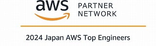
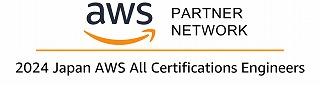
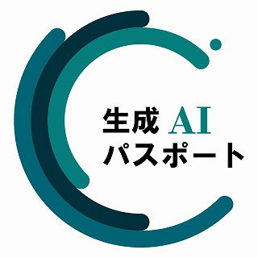

## Profile<!-- omit in toc -->

| key      | value                                                      |
| -------- | ---------------------------------------------------------- |
| Name     | TOMOAKI Ishihara                                           |
| Birthday | September 29th, 1979                                       |
| Company  | [NTT DATA CCS CORPORATION](https://www.nttdata-ccs.co.jp/) |
| Position | Cloud Engineer                                             |

<!-- ③ 実績数字カード -->

  

    
20K+

    
Monthly Views (Zenn)

  

  

    
25+

    
AWS Study Sessions

  

  

    
100+

    
Seminar Attendees

  

  

    
19

    
Certifications (AWS + Azure)

  

---

## SPECIAL SKILLS

- プロジェクト運営の能力 / Project Management Skills
  - 職種や技術領域をまたいだ、全体最適を目指した問題解決とプロジェクト推進
  - Backlog / Redmine を用いたタスク管理と、Slack / Teams による非同期コミュニケーション
- 上流工程の経験 / Experience in Upstream Processes
  - 現行システムの調査分析、要件定義、移行計画書の作成
- 開発経験 / Development Experience
  - AWS を活用した小～中規模 Web アプリケーションの設計・構築
    - CloudFront / WAF / Lambda / API Gateway / ECS / Fargate / Aurora / Athena
  - AWS CDK・CloudFormation による IaC 自動化
  - CodeCommit / CodePipeline / CodeBuild / CodeDeploy による CI/CD 構築
  - Docker 本番運用、PostgreSQL / MySQL / Oracle の設計・管理
- その他 / Other
  - 社内勉強会・学習コミュニティの形成
  - Zenn での技術記事執筆（2024年11月現在 56記事、月間平均 20,000 PV）
  - 社内 AWS 勉強会主催（2022年10月〜月1回、25回開催実績）
  - AWS Top Engineers 登壇・社内講演会企画（参加者100名以上）
  - GitHub で AWS リファレンスアーキテクチャ・CDK 実装例を公開

---

## HONORS & AWARDS

- **AWS Community Builder (Dev Tools)(2025)**
  - 
  - [AWS Community Builders](https://aws.amazon.com/jp/developer/community/community-builders/) / [My Page](https://builder.aws.com/community/@issy929)

- **Japan AWS Top Engineers (2024 / 2025)**
  - 
  - [APN Blog 2024](https://aws.amazon.com/jp/blogs/psa/2024-japan-aws-top-engineers/) / [APN Blog 2025](https://aws.amazon.com/jp/blogs/psa/2025-japan-aws-top-engineers/)

- **Japan AWS All Certifications Engineers (2024 / 2025)**
  - 
  - [APN Blog 2024](https://aws.amazon.com/jp/blogs/psa/2024-japan-aws-all-certifications-engineers/) / [APN Blog 2025](https://aws.amazon.com/jp/blogs/psa/2025-japan-all-aws-certifications-engineers/)

---

## QUALIFICATIONS

<!-- ② 資格バッジ：accordion + gallery でグリッド表示 -->




















- ネットワークスペシャリスト試験 (December 11, 2015)
- データベーススペシャリスト試験 (June 20, 2014)
- 応用情報技術者試験 (June 15, 2012)
- 基本情報技術者試験 (November 19, 2002)





- [Oracle Cloud Infrastructure Foundations 2021 Certified Associate](https://catalog-education.oracle.com/pls/certview/sharebadge?id=6A64358C41C39B4C58D7E1DABEBE8D4C37E2D5FD3EE83D03E952D0A9301657B1) (March 29, 2022)
- ORACLE MASTER Gold Oracle Database 10g (July 9, 2012)
- ORACLE MASTER Silver Oracle Database 10g (February 28, 2012)
- ORACLE MASTER Bronze Oracle Database 10g (December 9, 2011)
- Oracle Silver Fellow (December 1, 2004)





- [生成AIパスポート試験](https://www.openbadge-global.com/api/v1.0/openBadge/v2/Wallet/Public/GetAssertionShare/dy81TXUrTEF2VVA4VkdKTFBVaGpuUT09) (November 15, 2024)
  - 
- 普通自動車第一種運転免許 / Driver's License





---

## EDUCATION

TBD

---

## WORK EXPERIENCE

<!-- ① 職歴をタイムライン化 -->



- **2025 AWS Top Engineers & All Certifications Engineers** 受賞
- AWS Community Builders(DevTools)の認定（2025年の認定者1,007人、日本人は69人）
- 2025年10月、AWS社内勉強会3周年（開催実績：36 回）
- 社内で初のAWS BuilderCards体験会を主催



- ArcGIS Enterprise を AWS 上で構築・IaC 化
- 社内初の **2024 AWS Top Engineers & All Certifications Engineers** 受賞
- 受賞を受けた社内講演会の企画・登壇（参加者 100 名以上）
- CCoE 設立活動に参加
- 社内スペシャリスト制度の見直しに参画・助言
- 社内 AWS 検証環境のアカウントセキュリティポリシー策定を支援
- 2024年10月、AWS社内勉強会2周年（開催実績：24 回）



- オンプレ案件に AWS 早期レビュー環境を提案・構築（遠隔顧客との月次レビューを実現）
- Figma を導入してプロトタイプによる画面レビューの生産性を向上
- 社内 AWS 案件のレビュー・相談を担当
- 2023年10月、AWS社内勉強会1周年（開催実績：12 回）



- eラーニング SaaS とのシングルサインオンに Keycloak を採用（Amazon ECS / Fargate）
- **AWS CDK** による IaC を導入
- 2022年10月、月次 AWS 社内勉強会を発足
- Zenn での勉強会記事投稿を開始



- 自社 AI システムと連携した画像解析システムの AWS インフラ構築
- CloudFormation による IaC を導入
- CodeCommit / CodePipeline による CI/CD を導入



- AWS 案件をきっかけに AWS スキルの独自習得を開始



- 新卒入社
- アプリケーション開発・データベース設計・オンプレサーバー導入・プロジェクトリーダー等を担当




---

## INTEREST

- バックエンド・インフラだけでなく、新しい分野・技術への興味関心が高く、学習しながらアウトプットすることを意識しています
- フロントエンドの技術向上に力を入れています
- UI/UX の理解を深めるため、専門書の精読や業界のオンラインセミナーに積極的に参加しています

---

## LINKS

### Zenn

### AWS 勉強会資料公開

[AWS 勉強会資料公開 / AWS Study Group Materials](https://ishiharatma.github.io/aws-study/)

### GitHub

### dev.to

https://dev.to/issy929

### Qiita

https://qiita.com/issy929

---

## ADDITIONAL INFORMATION
